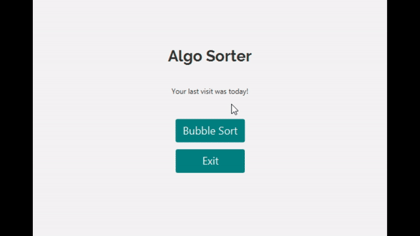

# Algo Sorter

Algo Sorter is an application designed for visualizing sorting algorithms.

## Installation

To use this program, make sure to have the JDK 11 and JavaFX 11 installed properly.

[JDK](https://www.oracle.com/java/technologies/javase-jdk11-downloads.html) \
[JavaFX](https://gluonhq.com/products/javafx/)

## Contributing

Pull requests are welcome. For major changes, please open an issue first to discuss what you would like to change.

## Licence

[MIT](https://choosealicense.com/licenses/mit/)